# FRRouting Documentation RAG System

RAG system for FRRouting documentation. Ask questions in natural language and get answers with specific configuration commands.

## Features

- Hybrid search (semantic + keyword matching)
- Answer generation via OpenAI GPT or Google Gemini
- Automatic documentation scraping
- Document chunking for vector search
- Adaptive relevance thresholding

## Pipeline

```mermaid
graph LR
    A[Documentation<br/>Website] -->|scraper.py| B[Markdown<br/>Files]
    B -->|chunking.py| C[Semantic<br/>Chunks]
    C -->|vectorize.py| D[Vector<br/>Embeddings]
    D -->|ChromaDB| E[Vector<br/>Database]
    E -->|rag_query.py| F[Semantic<br/>Search]
    F -->|LLM| G[Natural<br/>Answer]
    
    style A fill:#2196F3,stroke:#1976D2,stroke-width:2px,color:#fff
    style B fill:#FF9800,stroke:#F57C00,stroke-width:2px,color:#fff
    style C fill:#4CAF50,stroke:#388E3C,stroke-width:2px,color:#fff
    style D fill:#9C27B0,stroke:#7B1FA2,stroke-width:2px,color:#fff
    style E fill:#FFC107,stroke:#F9A825,stroke-width:2px,color:#000
    style F fill:#F44336,stroke:#D32F2F,stroke-width:2px,color:#fff
    style G fill:#00BCD4,stroke:#0097A7,stroke-width:2px,color:#fff
```



## Quick Start

See [QUICKSTART.md](QUICKSTART.md) for minimal setup instructions.

For detailed documentation, see [README_RAG.md](README_RAG.md).

## Installation

```bash
git clone <your-repo-url>
cd fr-docs-scraper

python3 -m venv venv
source venv/bin/activate  # Linux/Mac
pip install -r requirements.txt
```

## Project Structure

```
fr-docs-scraper/
├── scraper.py          # Documentation scraper
├── chunking.py         # Document chunking
├── vectorize.py        # Vector DB creation
├── query_db.py         # Simple search
├── rag_query.py        # RAG system (search + generation)
├── test_gemini.py      # Gemini API test
├── requirements.txt    # Dependencies
├── README.md           # This file
├── README_RAG.md       # Detailed RAG documentation
└── QUICKSTART.md       # Quick start guide
```

## Requirements

- Python 3.8+
- OpenAI or Google Gemini API key (for answer generation)

## License

MIT

